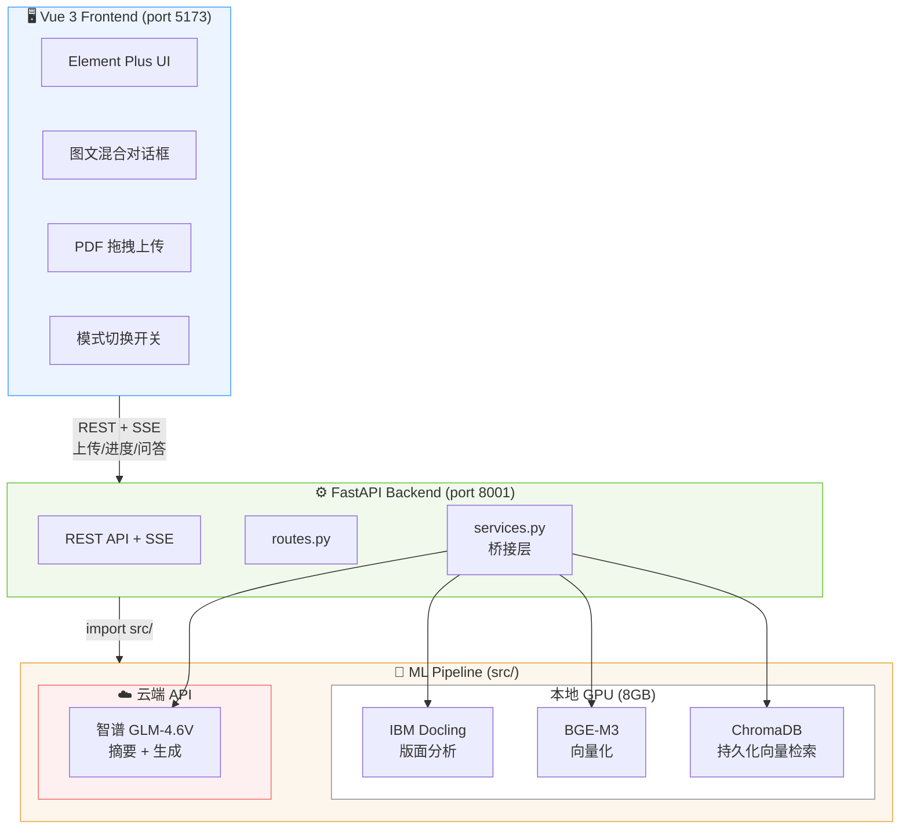
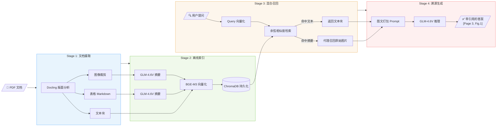

# MultimodalQA - 文档理解 + 多模态检索问答系统

> 基于 Multi-Vector Retriever 架构的文档智能助手，支持 PDF 上传、自动解析（文本/表格/图像分离）、多模态检索与带溯源引用的智能问答。

---

## 环境配置与运行

### 环境要求

- Python 3.10+
- Node.js 18+
- NVIDIA GPU 8GB+ (推荐) 或 Apple Silicon Mac (MPS)
- 智谱 AI API Key（[注册地址](https://open.bigmodel.cn/)）
- 开发时的系统是windows（有显卡），有对linux与mac做适配但是不一定可用（未测试）

### 仓库初始状态说明

为了让评测者能体验完整的"上传 → 解析 → 索引 → 问答"流程，本仓库**故意不附带**以下运行时产物，它们会在你按照下面步骤启动系统时**自动生成**：

| 路径 | 性质 | 何时生成 |
|---|---|---|
| `backend/documents/` | 上传 PDF 的副本 + 提取的图片/页面渲染 + 元数据 | 处理 PDF 时自动建立 |
| `backend/chroma_data/` | ChromaDB 持久化的向量索引（约 1~2 MB / 文档） | 处理 PDF 时自动建立 |
| `docling_output/` | Docling 解析的中间文件（处理完会被自动清理） | 处理 PDF 时临时建立 |
| `frontend/node_modules/` | 前端 npm 依赖（约 140 MB） | `npm install` 时安装 |
| `frontend/dist/` | 前端构建产物 | `npm run build` 时生成 |
| `**/__pycache__/` | Python 字节码缓存 | 自动生成 |
| `~/.cache/huggingface/` | BGE-M3 / Docling / 公式 OCR 模型权重（约 3~4 GB） | 首次启动时从 HuggingFace 下载 |

> **⚠️ 关于 `data/` 目录**：仓库里**保留了**两份测试 PDF（K-Means/GMM 实验报告 + IMDB 情感分类报告），方便评测者直接用 ▶ 触发处理来体验全流程。如果想测自己的 PDF，把它们放进 `data/` 即可（重启后端自动检测）。

> **⚠️ 关于 `.env`**：仓库里只有 `.env.example` 模板。请按照下面"配置 API Key"小节复制一份并填入你自己的智谱 API Key（**绝对不要把含 key 的 `.env` 提交到 git**）。

如果你看到磁盘上有上述目录，那是开发过程的本地副本，**不会**进入仓库（已在 `.gitignore` 里）。第一次拉取代码后**不需要任何手动清理**，直接按顺序执行下面的步骤即可。

### 1. 安装 Python 依赖

```bash
# 创建 conda 环境
conda create -n multimodalQA python=3.10 -y
conda activate multimodalQA

# 安装 PyTorch (根据平台选择一个)
# Windows (CUDA):
pip install torch torchvision --index-url https://download.pytorch.org/whl/cu126
# macOS (MPS):
pip install torch torchvision
# Linux (CPU only):
pip install torch torchvision --index-url https://download.pytorch.org/whl/cpu

# 安装其他依赖
pip install -r requirements.txt
```

### 2. 安装前端依赖

```bash
cd frontend
npm install
```

### 3. 配置 API Key

在项目根目录创建 `.env` 文件（复制.env.exampleb并且改名成.env），修改：
```env
ZHIPUAI_API_KEY=your_api_key_here
```

### 4. 启动服务

```bash
# 终端 1: 启动后端 (FastAPI)
conda activate multimodalQA
python -m uvicorn backend.main:app --reload --port 8001

# 终端 2: 启动前端 (Vue)
cd frontend
npm run dev
```


### 5. 访问

| 地址 | 说明 |
|------|------|
| http://localhost:5173 | 前端界面（主入口） |
| http://localhost:8001/docs | API 文档（Swagger UI） |

### 6. 使用介绍

#### 基本流程

```
方式一：拖拽上传
  → 左侧栏拖拽 PDF 进上传区
  → 自动开始处理（弹出进度条，2~5 分钟）
  → 文档变为 ✓ ready，点选后即可问答

方式二：批量预置（推荐演示前准备）
  → 把 PDF 放到项目 data/ 目录
  → 启动后端，约 2 分钟自动检测注册（状态为 ⏰ pending）
  → 在前端列表中点 ▶ 触发处理（2~5 分钟）
  → 完成后状态变为 ✓ ready
  → 注：方式二删除文档后需重启后端，前端才会重新显示
```

> **⏱ 关于处理时间**：单个 PDF 完整处理通常需要 **2~5 分钟**（页数/图表/公式越多越久）。耗时主要花在：①Docling 版面分析（GPU 加速）；②每张图/表调用 GLM-4.6V 生成摘要（5~10 秒/张）；③公式 OCR（首次会下载 CodeFormulaPredictor 模型权重）。
> **建议演示前用页数 < 10 的小 PDF 测试**，跑通后再换成完整文档。已处理的索引会被 ChromaDB 持久化到 `backend/chroma_data/`，重启后端无需重新构建。

---

#### 系统功能一览（可拍成演示视频的要点）

| 功能 | 怎么演示 |
|---|---|
| **① PDF 上传 + 实时进度** | 左栏拖拽 PDF → 弹出阶段化进度条（解析/切分/摘要/索引），中文阶段名 + 时间提示 |
| **② 多模态问答（看图回答）** | Multimodal 模式下问"从训练损失曲线来看哪种初始化下降更快？"<br/>→ 回答附带图表缩略图 + 引用页码 |
| **③ 纯文本对比（消融）** | 顶部右侧切换到 Text Only 模式，问同一题<br/>→ 模型回答"根据提供的文档内容无法回答"或给出模糊判断<br/>→ 展示出多模态相对于纯文本的优势 |
| **④ 引用溯源** | 任意回答下方点击 📄 第 X 页 → 弹窗显示对应原始页面图 |
| **⑤ 跨文档隔离** | 上传两份不同 PDF，分别问问题，左右切换文档 → 对话记录互不影响 |
| **⑥ 表格读数** | 问"Random 初始化的测试集准确率是多少？"<br/>→ 模型从 Markdown 表格中精确提取 0.5937 |
| **⑦ 混淆矩阵单元格读数** | 问"TF-IDF+LR 混淆矩阵中 negative→positive 的样本数？"<br/>→ Multimodal 答 1480；Text-only 拒答 |
| **⑧ LaTeX 公式渲染** | 在含公式的文档（如 K-Means/GMM 实验报告）上问"K-Means 目标函数公式是什么？"<br/>→ 前端用 KaTeX 把 `\sum_{j=1}^k ‖x_i - μ_j‖²` 渲染成漂亮数学符号 |
| **⑨ 多文档评测** | `python -m evaluation.run_eval` 跑 25 题，对比多模态 vs 纯文本的 ANLS / Accuracy<br/>→ 见 `evaluation/EVALUATION_REPORT.md` |

---

#### 推荐演示脚本（约 5 分钟视频）

1. **开场 (15s)**：展示前端首页（左侧文档列表 + 中间对话区 + 右上模式开关 + 左下问号），点 ❓ 弹出使用指南简单划过。
2. **上传 + 处理 (60s)**：拖拽一份小 PDF，展示弹出的中文阶段化进度条（"解析 PDF" → "VLM 图表摘要" → "BGE-M3 向量化"）。处理时口播解释多模态 RAG 离线索引的步骤。
3. **多模态问答 (60s)**：选中已 ready 的 K-Means/GMM 实验报告，Multimodal 模式下问"从训练损失曲线来看，哪种初始化方法的损失下降更快？" → 展示回答附带的曲线图 + 引用页码。点击 📄 标签弹出原页预览。
4. **消融对比 (60s)**：右上角切换到 Text Only，重问同样的问题 → 展示模型只能给出模糊回答或拒答。回到 Multimodal，问"K-Means 的目标函数公式" → 展示 KaTeX 渲染的 LaTeX 数学符号。
5. **引用溯源 + 跨文档 (60s)**：上传第二份 PDF（如电影评论情感分类报告），跨文档切换演示对话历史互不污染。在情感分类文档上问"哪个模型 Accuracy 最高？"，展示模型对柱状图的解读。
6. **评测结果 (45s)**：终端跑 `python -m evaluation.rescore`（无 API 消耗），展示 Multimodal 100% vs Text-only 56% 的对比表。打开 `evaluation/EVALUATION_REPORT.md` 划过关键案例。

---

#### 默认演示文档

仓库的 `data/` 目录已经预置两份测试 PDF：

| 文档 | 适合演示什么 |
|---|---|
| **测试数据（某次实验报告）.pdf**（K-Means/GMM 聚类实验，10 页） | 训练曲线趋势、Log-Likelihood 比较、表格读数、**LaTeX 公式渲染** |
| **大数据报告（电影评论情感二分类）.pdf**（IMDB BiLSTM 实验，7 页） | 柱状图比较、混淆矩阵单元格读数、跨图比较（4 张混淆矩阵） |

---

> **首次启动注意**：`data/` 目录下的 PDF 会自动注册但需要手动点 ▶ 触发处理。已构建过的索引会通过 ChromaDB 持久化到 `backend/chroma_data/`，重启后端后无需重新构建。前端通过 `data/` 方式上传后再删除的文档，需要重启后端才能重新被检测到。

---

## 项目概览

本系统针对包含复杂排版的 PDF 文档（多栏、嵌套表格、统计图表），构建了一套完整的多模态 RAG（Retrieval-Augmented Generation）管道。用户上传文档后，系统自动完成版面分析与结构化提取，并支持自然语言问答——回答中精确标注引用的页码与图表编号。

**核心创新点：** 通过消融实验证明，在面对"图表趋势分析"类问题时，多模态 RAG 的回答准确率显著优于纯文本 RAG（后者因缺乏视觉信息而产生错误判断）。

## 系统架构



### 四阶段处理流程



### 多模态 RAG vs 纯文本 RAG 对比设计


## 技术栈

| 层级 | 技术 | 用途 |
|------|------|------|
| **前端** | Vue 3 + Vite + Element Plus + KaTeX | 现代化 Web 交互界面 + LaTeX 公式渲染 |
| **后端** | FastAPI (Python) | REST API + SSE 流式响应 |
| **文档解析** | IBM Docling 2.95 | GPU 加速的 PDF 版面分析 |
| **向量模型** | BAAI/BGE-M3 (569M) | 1024 维 dense embedding，支持 8192 tokens |
| **向量数据库** | ChromaDB (持久化) | 余弦相似度检索，重启不丢数据 |
| **多模态大模型** | 智谱 GLM-4.6V | 图表/公式摘要生成 + 问答推理（含 thinking 推理） |
| **公式 OCR** | Docling CodeFormulaPredictor | 把 PDF 中的数学公式 OCR 为 LaTeX |
| **通信协议** | REST + SSE | 进度推送 + 答案输出 |

## 项目结构

```
MultimodalQA/
├── src/                           # 核心 ML 管道
│   ├── ingestion/                 # 文档解析与分块
│   │   ├── models.py             #   DocumentElement 数据模型
│   │   ├── docling_parser.py     #   Docling PDF 解析器
│   │   └── chunker.py           #   文本分块 (标题树/语义切分)
│   ├── indexing/                  # 摘要生成与向量化
│   │   ├── summarizer.py        #   VLM 图表摘要 (GLM-4.6V API)
│   │   └── embedder.py          #   BGE-M3 向量化 + ChromaDB 索引
│   ├── retrieval/                 # 多向量检索
│   │   └── retriever.py         #   Multi-Vector Retriever (代理召回)
│   ├── generation/                # 溯源生成
│   │   └── generator.py         #   带引用的多模态答案生成
│   └── baseline/                  # 消融对比
│       └── text_only_rag.py     #   纯文本 RAG 基线
│
├── backend/                       # FastAPI Web 后端
│   ├── main.py                   #   App 入口 + CORS + 静态文件
│   ├── routes.py                 #   API 路由 (7个端点)
│   ├── services.py               #   桥接层 (routes ←→ src/)
│   ├── progress.py               #   SSE 进度追踪 (asyncio.Queue)
│   ├── chroma_data/              #   ChromaDB 持久化数据
│   └── documents/                #   上传 PDF + 提取产物存储
│
├── frontend/                      # Vue 3 前端
│   ├── src/
│   │   ├── App.vue               #   根布局
│   │   ├── components/           #   UI 组件
│   │   │   ├── AppHeader.vue     #     顶栏 + RAG 模式切换
│   │   │   ├── Sidebar.vue       #     拖拽上传 + 文档列表
│   │   │   ├── ChatPanel.vue     #     聊天容器 + 输入框
│   │   │   ├── MessageBubble.vue #     消息气泡 (图文混合+引用)
│   │   │   ├── UploadProgress.vue#     解析进度弹窗
│   │   │   └── HelpGuide.vue    #     使用指南弹窗
│   │   ├── composables/          #   状态逻辑
│   │   │   ├── useChat.js        #     聊天 + 打字动画
│   │   │   ├── useUpload.js      #     上传 + 进度
│   │   │   └── useDocuments.js   #     文档列表管理
│   │   └── api/index.js          #   所有后端 API 调用
│   └── vite.config.js            #   开发代理配置
│
├── evaluation/                    # 评测系统
│   ├── EVALUATION_REPORT.md      #   详细评测报告（25 题 × 2 模式 × ANLS/Accuracy）
│   ├── metrics.py                #   ANLS（含子串/数值/有序比较）
│   ├── run_eval.py               #   自动化评测脚本（多文档路由）
│   ├── rescore.py                #   只用更新后的指标重新打分（不消耗 API）
│   └── datasets/
│       └── self_built_qa.json    #   自建 25 题 QA 数据集（跨 2 篇 PDF）
│
├── scripts/                       # 测试脚本
├── configs/config.yaml            # 系统配置
├── data/                          # 测试 PDF 文件
├── run.sh                         # 统一启动脚本
├── requirements.txt               # Python 依赖
└── .env                           # API Key (已 gitignore)
```

## API 端点

| 方法 | 路径 | 说明 |
|------|------|------|
| `POST` | `/api/upload` | 上传 PDF 文件，返回 task_id |
| `GET` | `/api/upload/{task_id}/progress` | SSE 流：解析进度实时推送 |
| `GET` | `/api/documents` | 获取已上传文档列表 |
| `POST` | `/api/documents/{id}/process` | 触发已注册文档的索引构建 |
| `DELETE` | `/api/documents/{id}` | 删除文档 |
| `GET` | `/api/documents/{id}/images/{name}` | 获取提取的图片 |
| `POST` | `/api/chat` | 问答（检索→生成→引用），返回 JSON |

## 开发进度

| 阶段 | 内容 | 状态 |
|------|------|------|
| Phase 1 | 文档解析管道 (Docling + 分块) | ✅ 完成 |
| Phase 2 | 多模态索引引擎 (VLM摘要 + BGE-M3 + ChromaDB) | ✅ 完成 |
| Phase 3 | 检索与生成 (Multi-Vector Retriever + 溯源) | ✅ 完成 |
| Phase 3b | 纯文本 RAG 基线对比 | ✅ 完成 |
| Phase 4 | 全栈 Web 前端 (Vue 3) + 后端 (FastAPI) | ✅ 完成 |
| Phase 5 | 数据集评测 (自建 QA + ANLS) | ✅ 完成 |

## 已验证的关键指标

### 解析性能（典型 7~10 页 PDF）

| 指标 | 数值 |
|------|------|
| 整体处理时间 | 约 2~5 分钟（GPU + Zhipu API） |
| Docling 版面分析 | 约 30~60 秒（CUDA 加速） |
| VLM 图表/表格摘要 | 约 5~10 秒/张（顺序调用 GLM-4.6V） |
| 公式 OCR（Docling CodeFormulaPredictor） | 约 50ms/公式（首次需下载 ~500MB 权重） |
| BGE-M3 向量化 | 约 1~2 秒（fp16 + CUDA） |

### 自建 QA 数据集评测（25 题 × 2 模式，详见 `evaluation/EVALUATION_REPORT.md`）

| 指标 | Multimodal RAG | Text-only RAG | 差距 |
|---|---|---|---|
| **整体 Accuracy** | **25/25 = 100%** | 14/25 = 56% | **+44 pp** |
| **整体 ANLS** | 1.0000 | 0.5600 | +0.4400 |
| 视觉问题（11 题） | **100%** | **9%** | **+91 pp** 🔥 |
| 表格问题（7 题） | 100% | 100% | 持平 |
| 文本问题（7 题） | 100% | 86% | +14 pp |

> **关键发现**：在 11 道必须看图才能回答的问题（混淆矩阵单元格、训练曲线趋势、柱状图比较、过拟合判断等）上，纯文本 RAG 几乎完全失效（仅答对 1 题），证明了多模态架构的必要性。

### 多模态 vs 纯文本对比（真实 Web Demo 测试结果）

> 测试问题：**"从训练损失曲线来看，两种方法的收敛过程有什么区别？"**

| 维度 | 🌈 多模态 RAG | 📝 纯文本 RAG |
|------|--------------|--------------|
| **检索结果** | 2 texts + **1 image** + 2 tables | 2 texts + 0 images + 2 tables |
| **关键判断** | ✅ "KMeans++\_init 的损失值**始终低于** Random\_init，下降速度更快" | ⚠️ "两种方法的损失在前期都快速下降，随后趋于平稳"（模糊、无差异判断） |
| **视觉依据** | 引用了 Figure 1 (训练损失折线图) 并展示原图 | 无图表支撑，只能从文字描述推测 |
| **回答质量** | 精确、有数据支撑 | 笼统、缺乏关键视觉对比信息 |

**结论**：对于需要图表视觉信息的问题，纯文本 RAG 因无法获取曲线走势而产生模糊/错误回答；多模态 RAG 通过代理召回原始图片，让 VLM 直接"看到"图表，回答显著更准确。详细评测报告见 [`evaluation/EVALUATION_REPORT.md`](evaluation/EVALUATION_REPORT.md)。

## 团队

- 庄仕豪 (23336355)
- 钟晨辉 (23336336)

## 参考文献

1. IBM Docling (2024) - 文档解析引擎
2. ColPali (ICLR 2025) - 纯视觉检索
3. M3DocRAG (2024) - 多文档多模态 RAG
4. VisRAG (ICLR 2025) - 视觉保留的必要性
5. BGE-M3 (BAAI, 2024) - 多功能嵌入模型
