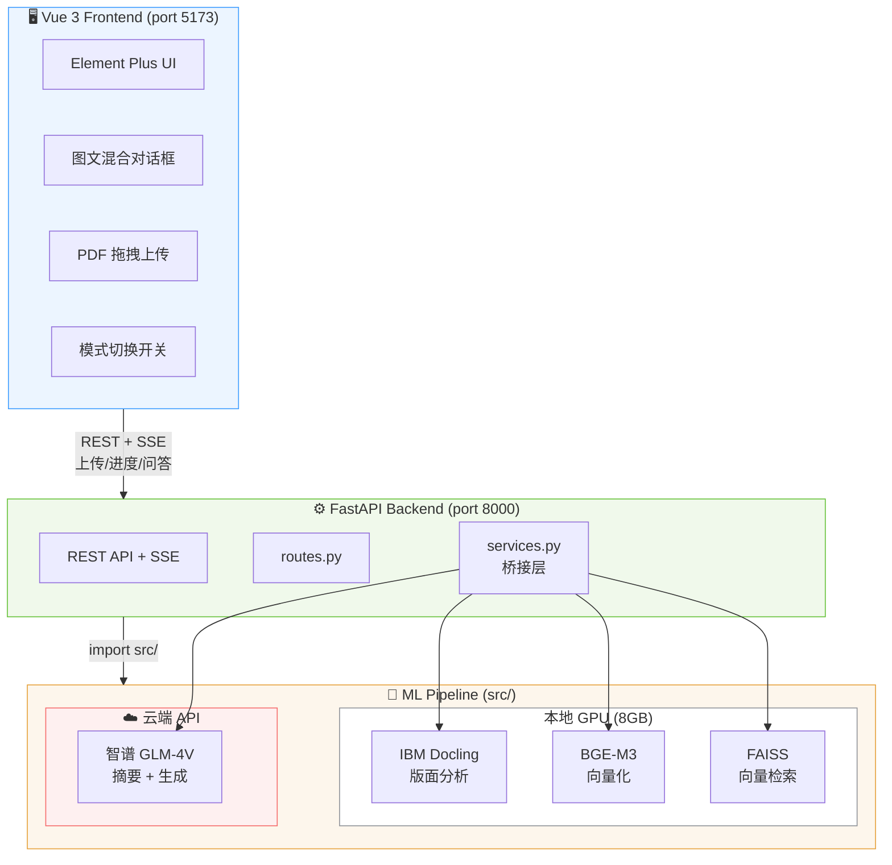
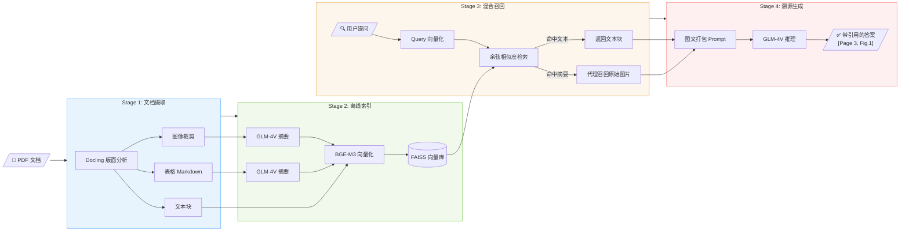
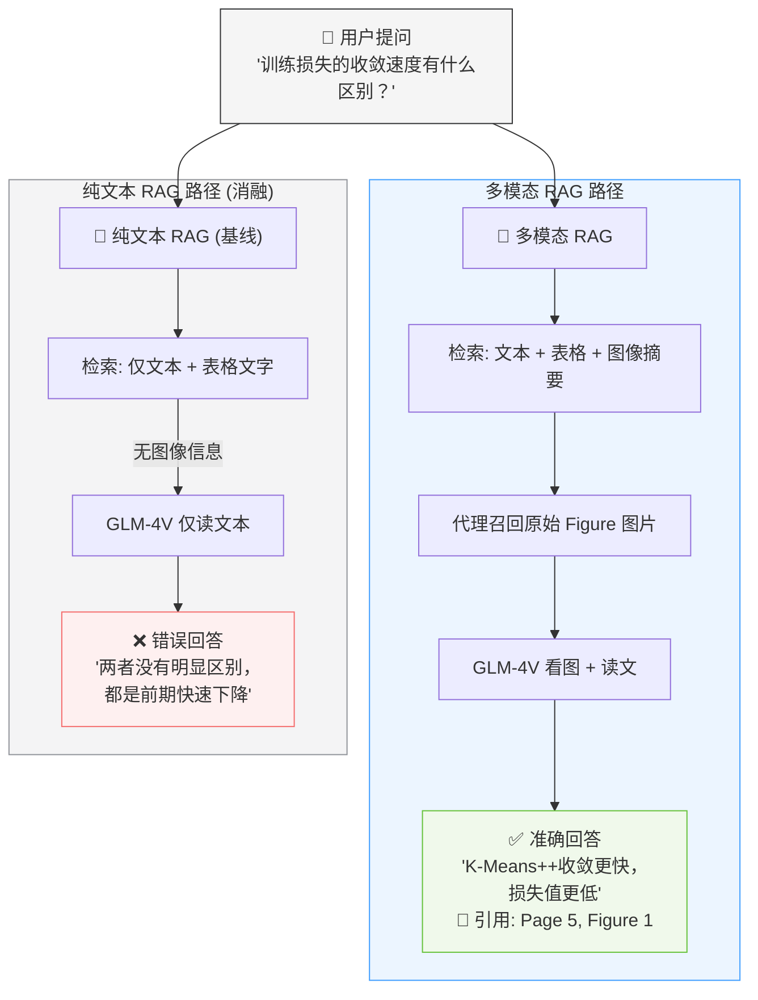

# MultimodalQA - 文档理解 + 多模态检索问答系统

> 基于 Multi-Vector Retriever 架构的文档智能助手，支持 PDF 上传、自动解析（文本/表格/图像分离）、多模态检索与带溯源引用的智能问答。

## 项目概览

本系统针对包含复杂排版的 PDF 文档（多栏、嵌套表格、统计图表），构建了一套完整的多模态 RAG（Retrieval-Augmented Generation）管道。用户上传文档后，系统自动完成版面分析与结构化提取，并支持自然语言问答——回答中精确标注引用的页码与图表编号。

**核心创新点：** 通过消融实验证明，在面对"图表趋势分析"类问题时，多模态 RAG 的回答准确率显著优于纯文本 RAG（后者因缺乏视觉信息而产生错误判断）。

## 系统架构



### 四阶段处理流程



### 多模态 RAG vs 纯文本 RAG 对比设计



## 技术栈

| 层级 | 技术 | 用途 |
|------|------|------|
| **前端** | Vue 3 + Vite + Element Plus | 现代化 Web 交互界面 |
| **后端** | FastAPI (Python) | REST API + SSE 流式响应 |
| **文档解析** | IBM Docling 2.95 | GPU 加速的 PDF 版面分析 |
| **向量模型** | BAAI/BGE-M3 (569M) | 1024 维 dense embedding，支持 8192 tokens |
| **向量数据库** | FAISS (CPU) | 余弦相似度检索 |
| **多模态大模型** | 智谱 GLM-4V-Flash | 图表摘要生成 + 问答推理 |
| **通信协议** | REST + SSE | 进度推送 + 答案流式输出 |

## 项目结构

```
MultimodalQA/
├── src/                           # 核心 ML 管道
│   ├── ingestion/                 # 文档解析与分块
│   │   ├── models.py             #   DocumentElement 数据模型
│   │   ├── docling_parser.py     #   Docling PDF 解析器
│   │   └── chunker.py           #   文本分块 (标题树/语义切分)
│   ├── indexing/                  # 摘要生成与向量化
│   │   ├── summarizer.py        #   VLM 图表摘要 (GLM-4V API)
│   │   └── embedder.py          #   BGE-M3 向量化 + FAISS 索引
│   ├── retrieval/                 # 多向量检索
│   │   └── retriever.py         #   Multi-Vector Retriever (代理召回)
│   ├── generation/                # 溯源生成
│   │   └── generator.py         #   带引用的多模态答案生成
│   └── baseline/                  # 消融对比
│       └── text_only_rag.py     #   纯文本 RAG 基线
│
├── backend/                       # FastAPI Web 后端
│   ├── main.py                   #   App 入口 + CORS + 静态文件
│   ├── routes.py                 #   API 路由 (7个端点)
│   ├── services.py               #   桥接层 (routes ←→ src/)
│   ├── progress.py               #   SSE 进度追踪 (asyncio.Queue)
│   └── documents/                #   上传 PDF + 提取产物存储
│
├── frontend/                      # Vue 3 前端
│   ├── src/
│   │   ├── App.vue               #   根布局
│   │   ├── components/           #   UI 组件
│   │   │   ├── AppHeader.vue     #     顶栏 + RAG 模式切换
│   │   │   ├── Sidebar.vue       #     拖拽上传 + 文档列表
│   │   │   ├── ChatPanel.vue     #     聊天容器 + 输入框
│   │   │   ├── MessageBubble.vue #     消息气泡 (图文混合+引用)
│   │   │   └── UploadProgress.vue#     解析进度弹窗
│   │   ├── composables/          #   状态逻辑
│   │   │   ├── useChat.js        #     聊天 + SSE 流式
│   │   │   ├── useUpload.js      #     上传 + 进度
│   │   │   └── useDocuments.js   #     文档列表管理
│   │   └── api/index.js          #   所有后端 API 调用
│   └── vite.config.js            #   开发代理配置
│
├── scripts/                       # 测试与评测脚本
│   ├── test_parsing.py           #   文档解析测试
│   ├── test_indexing.py          #   索引管道测试
│   └── test_qa.py                #   端到端 QA 对比测试
│
├── configs/config.yaml            # 系统配置
├── data/                          # 测试 PDF 文件
├── run.sh                         # 统一启动脚本
├── requirements.txt               # Python 依赖
└── .env                           # API Key (已 gitignore)
```

## 快速开始

### 环境要求

- Python 3.10+
- Node.js 18+
- NVIDIA GPU 8GB+ (推荐) 或 Apple Silicon Mac (MPS)
- 智谱 AI API Key

### 1. 安装 Python 依赖

```bash
# 创建 conda 环境
conda create -n multimodalQA python=3.10 -y
conda activate multimodalQA

# 安装 PyTorch (根据平台选择)
# Windows (CUDA):
pip install torch torchvision --index-url https://download.pytorch.org/whl/cu126
# macOS (MPS):
pip install torch torchvision

# 安装其他依赖
pip install -r requirements.txt
```

### 2. 安装前端依赖

```bash
cd frontend
npm install
```

### 3. 配置 API Key

创建 `.env` 文件：
```env
ZHIPUAI_API_KEY=your_api_key_here
```

### 4. 启动服务

```bash
# 终端 1: 启动后端 (FastAPI)
conda activate multimodalQA
python -m uvicorn backend.main:app --reload --port 8000

# 终端 2: 启动前端 (Vue)
cd frontend
npm run dev
```

或使用启动脚本：
```bash
./run.sh --platform win app       # 启动后端
./run.sh --platform win frontend  # 启动前端
```

### 5. 访问

- **前端界面**: http://localhost:5173
- **API 文档**: http://localhost:8000/docs

## API 端点

| 方法 | 路径 | 说明 |
|------|------|------|
| `POST` | `/api/upload` | 上传 PDF 文件，返回 task_id |
| `GET` | `/api/upload/{task_id}/progress` | SSE 流：解析进度实时推送 |
| `GET` | `/api/documents` | 获取已上传文档列表 |
| `GET` | `/api/documents/{id}` | 获取单个文档元数据 |
| `DELETE` | `/api/documents/{id}` | 删除文档 |
| `GET` | `/api/documents/{id}/images/{name}` | 获取提取的图片 |
| `POST` | `/api/chat` | 问答（检索→生成→引用），返回 JSON |

## 开发进度

| 阶段 | 内容 | 状态 |
|------|------|------|
| Phase 1 | 文档解析管道 (Docling + 分块) | ✅ 完成 |
| Phase 2 | 多模态索引引擎 (VLM摘要 + BGE-M3 + FAISS) | ✅ 完成 |
| Phase 3 | 检索与生成 (Multi-Vector Retriever + 溯源) | ✅ 完成 |
| Phase 3b | 纯文本 RAG 基线对比 | ✅ 完成 |
| Phase 4 | 全栈 Web 前端 (Vue 3) + 后端 (FastAPI) | ✅ 完成 |
| Phase 5 | 数据集评测 (自建 QA + ANLS) | ✅ 完成 |

## 已验证的关键指标

### 解析性能 (10 页 PDF)

| 指标 | 数值 |
|------|------|
| 解析时间 | ~10s (GPU) |
| 文本块提取 | 25 chunks |
| 表格提取 | 4 tables (Markdown) |
| 图像提取 | 4 figures (高清 PNG) |
| 页面渲染 | 10 pages (2x scale) |

### 检索准确性

| 查询类型 | Top-1 命中 | 相似度得分 |
|----------|-----------|-----------|
| 算法描述 (文本) | ✅ 精确命中 | 0.75 |
| 协方差结构影响 (文本) | ✅ 精确命中 | 0.71 |
| 训练损失趋势 (图表) | ✅ 图表摘要命中 | 0.61 |
| 准确率对比 (表格) | ✅ 表格摘要命中 | 0.69 |

### 多模态 vs 纯文本对比（真实 Web Demo 测试结果）

> 测试问题：**"从训练损失曲线来看，两种方法的收敛过程有什么区别？"**

| 维度 | 🌈 多模态 RAG | 📝 纯文本 RAG |
|------|--------------|--------------|
| **检索结果** | 2 texts + **1 image** + 2 tables | 2 texts + 0 images + 2 tables |
| **关键判断** | ✅ "KMeans++\_init 的损失值**始终低于** Random\_init，下降速度更快" | ⚠️ "两种方法的损失在前期都快速下降，随后趋于平稳"（模糊、无差异判断） |
| **视觉依据** | 引用了 Figure 1 (训练损失折线图) 并展示原图 | 无图表支撑，只能从文字描述推测 |
| **回答质量** | 精确、有数据支撑 | 笼统、缺乏关键视觉对比信息 |

**结论**：对于需要图表视觉信息的问题，纯文本 RAG 因无法获取曲线走势而产生模糊/错误回答；多模态 RAG 通过代理召回原始图片，让 VLM 直接"看到"图表，回答显著更准确。

## 跨平台支持

| 平台 | GPU | 设备检测 | 状态 |
|------|-----|---------|------|
| Windows + CUDA | RTX 4060/4070 | `auto → cuda` | ✅ 主力开发 |
| macOS + MPS | Apple Silicon | `auto → mps` | ✅ 已适配 |
| Linux + CPU | 无 GPU | `auto → cpu` | ✅ 可用 |

## 团队

- 庄仕豪 (23336355)
- 钟晨辉 (23336336)

## 参考文献

1. IBM Docling (2024) - 文档解析引擎
2. ColPali (ICLR 2025) - 纯视觉检索
3. M3DocRAG (2024) - 多文档多模态 RAG
4. VisRAG (ICLR 2025) - 视觉保留的必要性
5. BGE-M3 (BAAI, 2024) - 多功能嵌入模型
